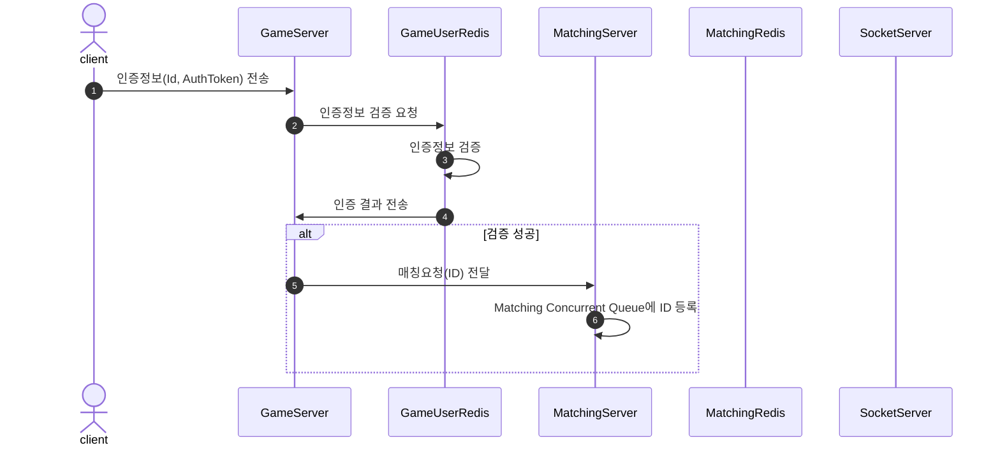

# Matching Request
 

```mermaid
sequenceDiagram
  autonumber
  actor A as client
  participant B as GameServer
  participant C as GameUserRedis
  participant D as MatchingServer
  participant E as MatchingRedis
  participant F as SocketServer

  A->>B: 인증정보(Id, AuthToken) 전송
  B->>C: 인증정보 검증 요청
  C->>C: 인증정보 검증
  C->>B: 인증 결과 전송

  alt 검증 성공
    B->>D: 매칭요청(ID) 전달
    D->>D: Matching Concurrent Queue에 ID 등록
  end
```
