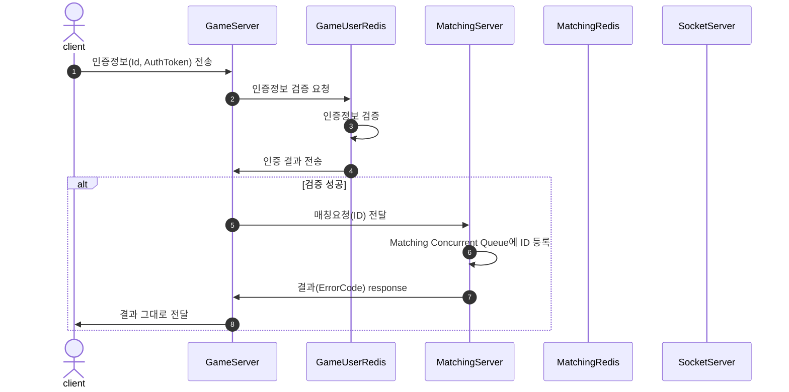
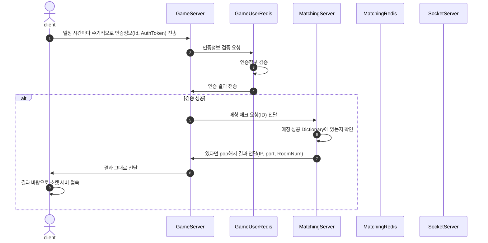
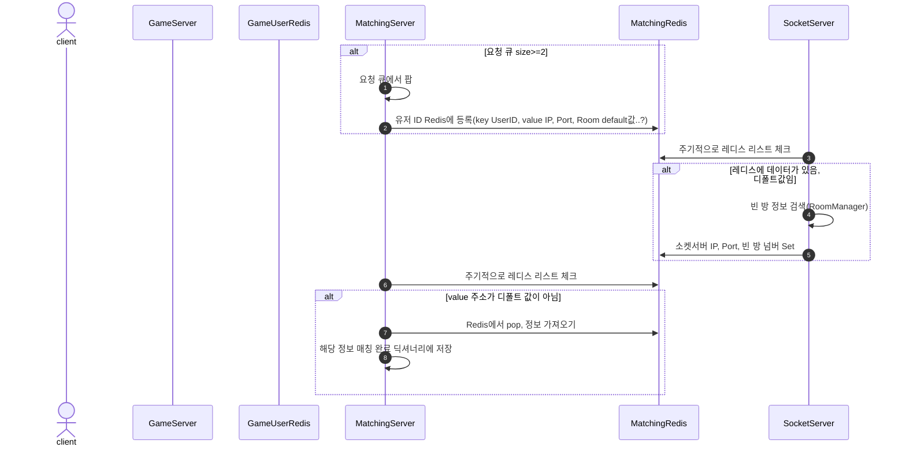

# Matching Request
 

```mermaid
sequenceDiagram
  autonumber
  actor A as client
  participant B as GameServer
  participant C as GameUserRedis
  participant D as MatchingServer
  participant E as MatchingRedis
  participant F as SocketServer

  A->>B: 인증정보(Id, AuthToken) 전송
  B->>C: 인증정보 검증 요청
  C->>C: 인증정보 검증
  C->>B: 인증 결과 전송

  alt 검증 성공
    B->>D: 매칭요청(ID) 전달
    D->>D: Matching Concurrent Queue에 ID 등록
    D->>B: 결과(ErrorCode) response
    B->>A: 결과 그대로 전달
  end
```

# Matching Check
 

```mermaid
sequenceDiagram
  autonumber
  actor A as client
  participant B as GameServer
  participant C as GameUserRedis
  participant D as MatchingServer
  participant E as MatchingRedis
  participant F as SocketServer

  A->>B: 일정 시간마다 주기적으로 인증정보(Id, AuthToken) 전송
  B->>C: 인증정보 검증 요청
  C->>C: 인증정보 검증
  C->>B: 인증 결과 전송

  alt 검증 성공
    B->>D: 매칭 체크 요청(ID) 전달
    D->>D: 매칭 성공 Dictionary에 있는지 확인
    D->>B: 있다면 pop해서 결과 전달(IP, port, RoomNum)
    B->>A: 결과 그대로 전달
    A->>A: 결과 바탕으로 소켓 서버 접속
  end
```

# Matching - Matching & Socket Server side 
 

```mermaid
sequenceDiagram
  autonumber
  actor A as client
  participant B as GameServer
  participant C as GameUserRedis
  participant D as MatchingServer
  participant E as MatchingRedis
  participant F as SocketServer

  alt 요청 큐 size>=2
    D->>D: 요청 큐에서 팝
    D->>E: 유저 ID Redis에 등록(key UserID, value IP, Port, Room default값..?)
  end

  F->>E: 주기적으로 레디스 리스트 체크
  alt 레디스에 데이터가 있음, 디폴트값임
    F->>F: 빈 방 정보 검색(RoomManager)
    F->>E: 소켓서버 IP, Port, 빈 방 넘버 Set
  end

  D->>E: 주기적으로 레디스 리스트 체크
  alt value 주소가 디폴트 값이 아님
    D->>E: Redis에서 pop, 정보 가져오기
    D->>D: 해당 정보 매칭 완료 딕셔너리에 저장
  end

```

