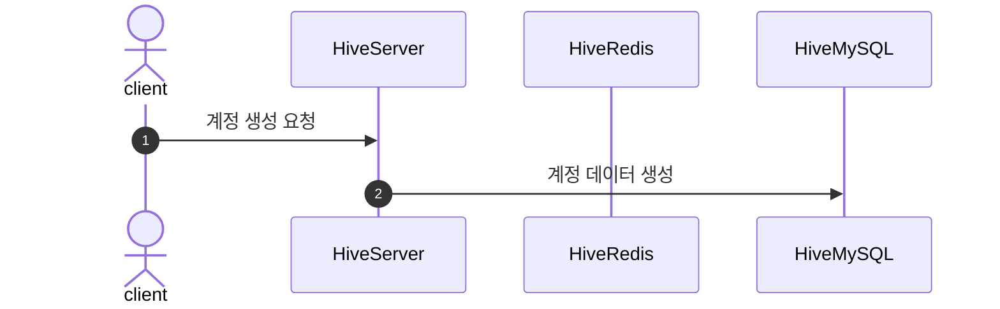
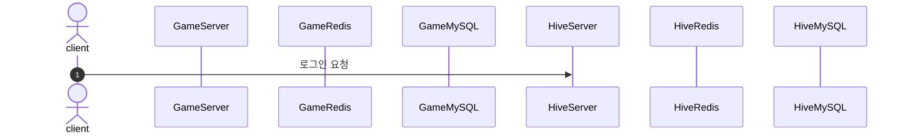

# Create Account

```mermaid
sequenceDiagram
  autonumber
  actor A as client
  participant B as HiveServer
  participant C as HiveRedis
  participant D as HiveMySQL
  A->>B: 계정 생성 요청
  B->>D: 계정 데이터 생성
```

# Login

```mermaid
sequenceDiagram
  autonumber
  actor A as client
  participant B as GameServer
  participant C as GameRedis
  participant D as GameMySQL
  participant E as HiveServer
  participant F as HiveRedis
  participant G as HiveMySQL
  A->>E:로그인 요청
```
