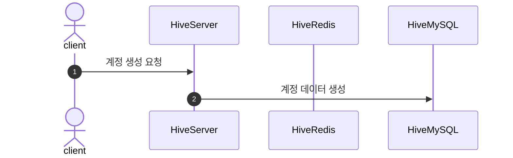

# Create Account



# Login

```mermaid
sequenceDiagram
  autonumber
  actor A as client
  participant B as GameServer
  participant C as GameRedis
  participant D as GameMySQL
  participant E as HiveServer
  participant F as HiveRedis
  participant G as HiveMySQL
  A->>E:로그인 요청
  E->>G: 데이터 조회 요청
  G-->>E: 데이터 반환
  E->>F: 인증토큰 저장
  E-->>A: 인증토큰 전달
  A->>B: 인증토큰을 통한 로그인 요청
  B-->>E: 인증토큰 유효성 검증 요청
  E->>F: 인증토큰 데이터 조회
  F-->>E: 인증토큰 존재 여부 반환
  E->>B: 유효성 체크 결과 전달
  alt 검증 실패
    B-->>A: 로그인 실패 응답
  B->>D: 인증토큰을 통해 유저 데이터 요청
  alt 존재하지 않는 유저
    D->>D: 유저 데이터 생성
  D-->>B: 유저 데이터 로드
  B-->>C: 인증토큰 저장
  B-->>A: 로그인 성공 응답
  
```
